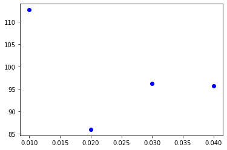
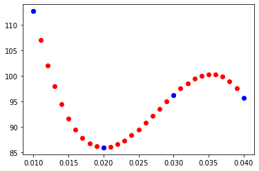

# Interpolation with Taylor Series Approximation function from random scattering values (taylorseries)

**taylorseries** is a small package that computes the Taylor Series function from random scattering values. Normally, it is hard to achieve a function that fits to all the points on a xy-diagramm. This method helps us to figure out the function.

## Installation

Please use **gitclone**.

## Usage

Initialize to ensure that all required packages are installed (numpy & matplotlib)
```bash
make init
```

Run the program **./taylorseries/taylorseries.py**
```bash
make run
```

Run the test for this small package
```bash
make test
```

Generate the **README.md** from **README.ipynb** (makesure jupyter is installed)
```bash
make readme
```

Generate the documentation with Sphinx, the documentation is the file **./docs/build/html/index.html**:
```bash
cd ./docs/
make html
```

## Explanation
Before that, let's import some packages that will be used in this section. Numpy and Matplotlib will be used.


```python
import numpy as np
import matplotlib.pyplot as plt
```

Let's import the small package that I have written, which is in the file "./taylorseries/taylorseries.py"


```python
from taylorseries import taylorseries as ts
```

Then, we generate some values for the x-axis with the domain of [0.01, 0.02, 0.03, 0.04]


```python
x_src = np.arange(start=0.01, stop=0.05, step=0.01)
x_src
```


    array([0.01, 0.02, 0.03, 0.04])


And some random y-axis value, which corresponds witht the x_src


```python
y_src = np.random.uniform(75.5, 125.5, size=len(x_src))
y_src
```


    array([124.18512554,  80.03638445,  93.95848787,  93.68825581])


Let's see how the graph of x_src and y_src are correlated.


```python
plt.plot(x_src, y_src, 'bo')
```


    [<matplotlib.lines.Line2D at 0x7fb62a9bbaf0>]


    

    


According to Taylor Series Approximation, we know that the function is defined as


If we have multiple input variables x and output variables y, we can figure out a Taylor Series function from these domains (input variables x) and co-domains (output variables y) through matrix multiplication:


where

,
,


Since, the vector  and matrix  are known, so


So, first we need to calculate the matrix 

And here is the function the I have written to generate the matrix  from x_src:


```python
X = ts.gen_matrix_X(x_src)
X
```


    array([[1.0e+00, 1.0e-02, 1.0e-04, 1.0e-06],
           [1.0e+00, 2.0e-02, 4.0e-04, 8.0e-06],
           [1.0e+00, 3.0e-02, 9.0e-04, 2.7e-05],
           [1.0e+00, 4.0e-02, 1.6e-03, 6.4e-05]])


To compute the vector constants:


```python
consts = ts.gen_constants(X, y_src)
consts
```


    array([ 2.98667891e+02, -2.63737504e+04,  1.01298602e+06, -1.20438633e+07])


Let's test the computed vector constants are working well, I have written the taylor function which accepts the input vector x and the vector constants as variables. Then, the output vector y is returned:


```python
y_test = ts.fcn_taylors(x_src, consts)
y_test
```


    array([124.18512554,  80.03638445,  93.95848787,  93.68825581])


We can see the value difference between the original vector y_src and the test result vector y_test. The differences are very small which can be ignored.


```python
y_test - y_src
```


    array([-1.70530257e-13,  0.00000000e+00,  1.70530257e-13,  0.00000000e+00])


And now the interpolation can be tested:


```python
x_interpolate = np.arange(start=0.01, stop=0.04, step=0.001)
x_interpolate
```


    array([0.01 , 0.011, 0.012, 0.013, 0.014, 0.015, 0.016, 0.017, 0.018,
           0.019, 0.02 , 0.021, 0.022, 0.023, 0.024, 0.025, 0.026, 0.027,
           0.028, 0.029, 0.03 , 0.031, 0.032, 0.033, 0.034, 0.035, 0.036,
           0.037, 0.038, 0.039])


```python
y_interpolate = ts.fcn_taylors(x_interpolate, consts)
y_interpolate
```


    array([124.18512554, 115.0975628 , 107.24107712, 100.54340533,
            94.93228424,  90.33545068,  86.68064147,  83.89559341,
            81.90804335,  80.64572809,  80.03638445,  80.00774926,
            80.48755933,  81.40355149,  82.68346256,  84.25502935,
            86.04598868,  87.98407738,  89.99703226,  92.01259015,
            93.95848787,  95.76246223,  97.35225005,  98.65558817,
            99.60021338, 100.11386252, 100.12427241,  99.55917986,
            98.3463217 ,  96.41343474])


```python
plt.plot(x_interpolate, y_interpolate, 'ro')
plt.plot(x_src, y_src, 'bo')
```


    [<matplotlib.lines.Line2D at 0x7fb62ccb0460>]


    

    


As we can see that the interpolation and the taylor function from random scattering values are successfully computed.

## Contributing

I'm writing this to test out how sphinx documentation and unittest works. The most important is to have fun. ^^

If there is some other algorithms that seems interesting, Maybe I will do some updates.

If you want to contribute too, you can fork it, but I'm still figuring it how the github works. ^^

contact: yeeyang.tan@live.com

## License

[MIT](./LICENSE)

## Reference

- Abramowitz, Milton; Stegun, Irene A. (1970), Handbook of Mathematical Functions with Formulas, Graphs, and Mathematical Tables, New York: Dover Publications, Ninth printing
- Thomas, George B., Jr.; Finney, Ross L. (1996), Calculus and Analytic Geometry (9th ed.), Addison Wesley, ISBN 0-201-53174-7
- Greenberg, Michael (1998), Advanced Engineering Mathematics (2nd ed.), Prentice Hall, ISBN 0-13-321431-1
- 3Blue1Brown (2017), Taylor series | Essence of calculus, chapter 11, https://www.youtube.com/watch?v=3d6DsjIBzJ4&t=15s

